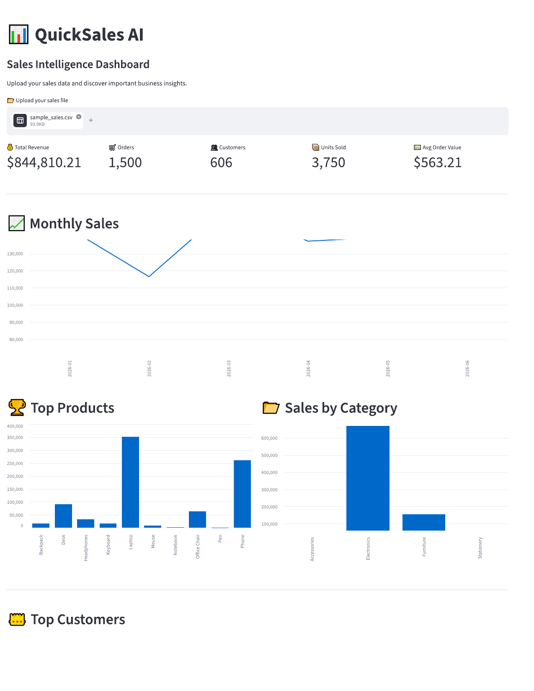
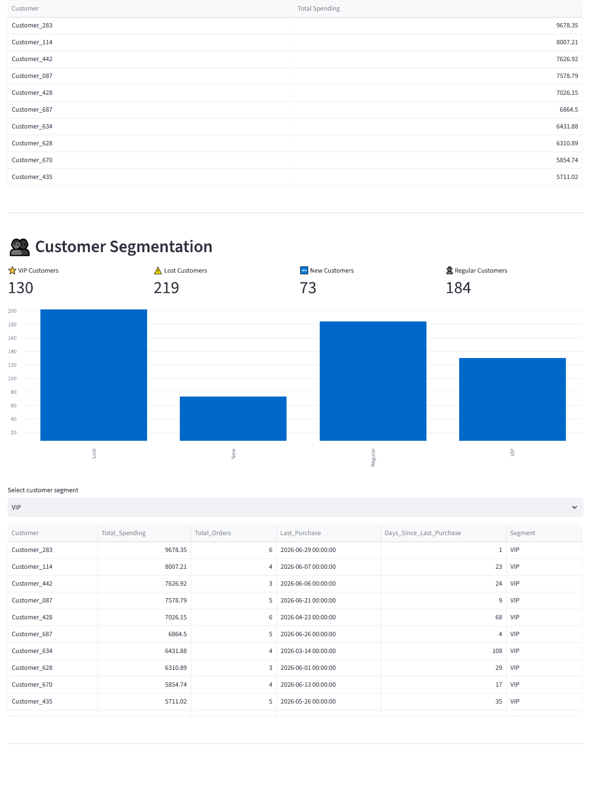
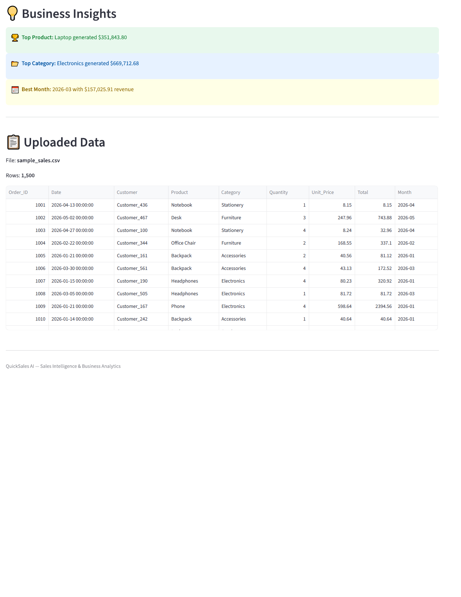

# QuickSales AI

## Sales Intelligence Dashboard
## Dashboard Preview



QuickSales AI is a business intelligence tool that transforms raw sales data from Excel or CSV files into clear, actionable business insights.

## Customer Segmentation



## Business Insights



## What Does It Do?

QuickSales AI helps businesses understand:

* How much revenue they generate
* Which products perform best
* Which categories generate the most revenue
* How sales change over time
* Which customers are most valuable
* Which customers may have become inactive
* Where potential business opportunities exist

## Key Features

### Sales Performance

* Total Revenue
* Total Orders
* Total Customers
* Total Units Sold
* Average Order Value

### Product Intelligence

* Best-selling products
* Product revenue
* Product performance
* Category performance

### Customer Intelligence

* VIP Customers
* Regular Customers
* New Customers
* Lost Customers

### Sales Trends

* Monthly revenue
* Monthly growth
* Best-performing months
* Sales declines

### Business Insights

QuickSales AI converts analytical results into practical business recommendations.

## Input

The application accepts:

* CSV
* Excel (.xlsx)

### Required Columns

The uploaded file should contain the following columns:

* Date
* Order_ID
* Customer
* Product
* Category
* Quantity
* Total

## Technology

* Python
* Pandas
* NumPy
* Matplotlib
* Streamlit
* Excel / CSV Data Analysis

## Business Value

Instead of manually analyzing large spreadsheets, businesses can upload their sales data and quickly discover important trends, customer segments, product opportunities, and actionable business insights.

## Demo

### Live Demo

Coming soon.

## Project Structure

```text
QuickSales-AI/
│
├── app.py
├── requirements.txt
├── README.md
├── sample_sales.csv
│
├── QuickSales_AI_Dashboard.png
├── QuickSales_AI_Customer_Segmentation.png
└── QuickSales_AI_Business_Insights.png


## How to Run Locally

Install the required dependencies:

```bash
pip install -r requirements.txt
```

Run the application:

```bash
streamlit run app.py
```

The dashboard will open in your browser.

## Business Use Cases

QuickSales AI can help businesses with:

* Sales performance monitoring
* Product performance analysis
* Customer segmentation
* Revenue trend analysis
* Identification of inactive customers
* Identification of high-value customers
* Business decision-making

## Future Development

Planned improvements may include:

* Advanced customer analytics
* Automated PDF reports
* Advanced sales forecasting
* AI-powered business recommendations
* Additional business intelligence dashboards

## Author

**DataNovaAI Team**

Specialized in:

* Data Analysis
* Business Intelligence
* Python
* Machine Learning
* Data Visualization
* AI Solutions

## License

This project is intended for demonstration and business analytics purposes.
